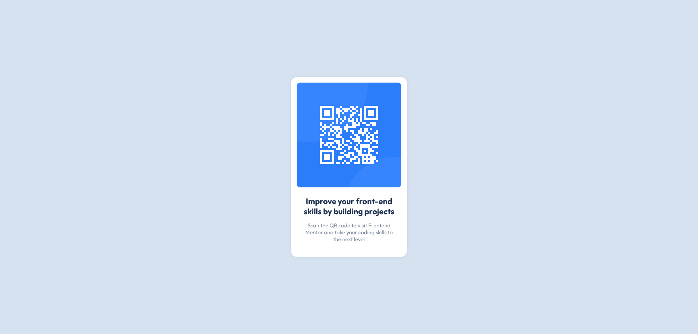

# Frontend Mentor - QR code component solution

This is a solution to the [QR code component challenge on Frontend Mentor](https://www.frontendmentor.io/challenges/qr-code-component-iux_sIO_H). Frontend Mentor challenges help you improve your coding skills by building realistic projects. 

## Table of contents

- [Overview](#overview)
  - [Screenshot](#screenshot)
  - [Links](#links)
- [My process](#my-process)
  - [Built with](#built-with)
  - [What I learned](#what-i-learned)
  - [Continued development](#continued-development)
  - [Useful resources](#useful-resources)
- [Author](#author)

## Overview

### Screenshot

### Links

- Solution URL: [GitHub](https://github.com/mbdelarosa/qr-code-component-main)
- Live Site URL: [QR Code Component](https://mbdelarosa.github.io/qr-code-component-main/)

## My process

### Built with

- Semantic HTML5 markup
- CSS custom properties
- Flexbox
- Mobile-first workflow

### What I learned

Through this challenge, I was able to learn the following concepts:
- CSS Reset
- Use of `rem` for `font-size` instead of `px`
- Mobile-first development
- HTML5 Landmarks
- Use of flex properties to center elements

### Continued development

In future projects, I'd like to continue my learning and application of the following:
- Flexbox
- CSS Grid
- HTML5 Markup
- Best practices in frontend development

### Useful resources

- [Accessible Landmarks | scottohara.me](https://www.scottohara.me/blog/2018/03/03/landmarks.html) - This gave a good introduction on what HTML5 landmarks are, providing use cases and examples that are really helpful
- [Should I change the default HTML font-size to 62.5%? - FED Mentor](https://fedmentor.dev/posts/rem-html-font-size-hack/) - This was really insightful on when and how to use `rem` instead of `px`, as well as providing additional techniques to make this conversion easier
- For the CSS reset, the following resources proved to be very helpful:
  - [A Modern CSS Reset - Andy Bell](https://andy-bell.co.uk/a-modern-css-reset/)
  - [Modern CSS Reset / Global Styles](https://www.joshwcomeau.com/css/custom-css-reset/)

## Author

- Frontend Mentor - [@mbdelarosa](https://www.frontendmentor.io/profile/mbdelarosa)